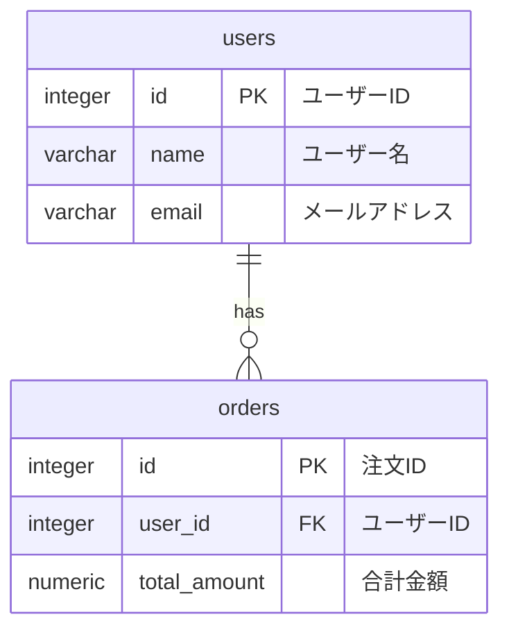

# pgmcp

[](https://github.com/kyagoshi/pgmcp/actions/workflows/test.yml)
[](https://github.com/kyagoshi/pgmcp/actions/workflows/pip-audit.yml)


PostgreSQLデータベースのテーブル情報を取得するMCPサーバーです。

## 機能

- **list_tables**: 指定したスキーマのテーブル一覧を取得
- **get_table_schema**: 指定したテーブルのカラム情報（名前、型、NULL許可、デフォルト値、主キー、コメント）を取得
- **get_table_indexes**: 指定したテーブルのインデックス情報（名前、カラム、ユニーク、タイプ、定義）を取得
- **get_foreign_keys**: 指定したテーブルの外部キー情報（制約名、カラム、参照先テーブル、参照先カラム）を取得
- **generate_er_diagram** [BETA]: データベースのテーブル関係をMermaid形式のER図として生成

### セキュリティ

データベース接続は**リードオンリー**で確立されます。誤操作や破壊的なクエリ実行を防ぐため、書き込み系のSQL（INSERT、UPDATE、DELETE、CREATE など）は実行できません。

## 要件

- Python 3.10以上
- uv（パッケージ管理）
- PostgreSQLデータベースへのアクセス

## インストール

### uvx（推奨）

`uvx`を使えばインストール不要で直接実行できます:

```bash
uvx --from git+https://github.com/kyagoshi/pgmcp pgmcp
```

特定バージョンを固定したい場合は `@<タグ>` を指定してください（例: `v0.1.0`）:

```bash
uvx --from git+https://github.com/kyagoshi/pgmcp@v0.1.0 pgmcp
```

### ローカルインストール

```bash
git clone https://github.com/kyagoshi/pgmcp.git
cd pgmcp
uv sync
```

`pip` を使う場合のバージョン固定例:

```bash
pip install "git+https://github.com/kyagoshi/pgmcp@v0.1.0"
```

## MCP設定

### Claude Desktop

`~/Library/Application Support/Claude/claude_desktop_config.json`（macOS）または`%APPDATA%\Claude\claude_desktop_config.json`（Windows）に以下を追加:

```json
{
  "mcpServers": {
    "pgmcp": {
      "command": "uvx",
      "args": ["--from", "git+https://github.com/kyagoshi/pgmcp", "pgmcp"],
      "env": {
        "PGHOST": "localhost",
        "PGPORT": "5432",
        "PGDATABASE": "your_database",
        "PGUSER": "your_username",
        "PGPASSWORD": "your_password"
      }
    }
  }
}
```

### VS Code (GitHub Copilot)

[](vscode:mcp/install?%7B%22name%22%3A%22pgmcp%22%2C%22type%22%3A%22stdio%22%2C%22command%22%3A%22uvx%22%2C%22args%22%3A%5B%22--from%22%2C%22git%2Bhttps%3A%2F%2Fgithub.com%2Fkyagoshi%2Fpgmcp%22%2C%22pgmcp%22%5D%2C%22env%22%3A%7B%22PGHOST%22%3A%22localhost%22%2C%22PGPORT%22%3A%225432%22%2C%22PGDATABASE%22%3A%22your_db_name%22%2C%22PGUSER%22%3A%22your_postgres_username%22%2C%22PGPASSWORD%22%3A%22your_postgres_username%22%7D%7D)

`.vscode/mcp.json` に以下を追加:

```json
{
  "servers": {
    "pgmcp": {
      "type": "stdio",
      "command": "uvx",
      "args": ["--from", "git+https://github.com/kyagoshi/pgmcp", "pgmcp"],
      "env": {
        "PGHOST": "localhost",
        "PGPORT": "5432",
        "PGDATABASE": "your_database",
        "PGUSER": "your_username",
        "PGPASSWORD": "your_password"
      }
    }
  }
}
```

### 環境変数

| 変数名 | 説明 | デフォルト値 |
|--------|------|-------------|
| `PGHOST` | PostgreSQLホスト名 | `localhost` |
| `PGPORT` | PostgreSQLポート番号 | `5432` |
| `PGDATABASE` | データベース名 | （必須） |
| `PGUSER` | ユーザー名 | （必須） |
| `PGPASSWORD` | パスワード | （必須） |

## 使用方法

### list_tables

指定したスキーマのテーブル一覧を取得します。

**パラメータ:**

- `schema` (string, optional): スキーマ名。デフォルトは `"public"`

**出力例:**

```text
| table_name | table_type |
|------------|------------|
| users | BASE TABLE |
| orders | BASE TABLE |
```

### get_table_schema

指定したテーブルのカラム情報を取得します。

**パラメータ:**

- `table_name` (string, required): テーブル名
- `schema` (string, optional): スキーマ名。デフォルトは `"public"`

**出力例:**

```text
| column_name | data_type | nullable | default | PK | comment |
|-------------|-----------|----------|---------|-----|----------|
| id | integer | NO | nextval('users_id_seq'::regclass) | ✓ | ユーザーID |
| name | character varying(100) | NO | - |  | ユーザー名 |
| email | character varying(255) | YES | - |  | メールアドレス |
```

### get_table_indexes

指定したテーブルのインデックス情報を取得します。

**パラメータ:**

- `table_name` (string, required): テーブル名
- `schema` (string, optional): スキーマ名。デフォルトは `"public"`

**出力例:**

```text
| index_name | columns | unique | type | definition |
|------------|---------|--------|------|------------|
| users_pkey | id | ✓ | btree | CREATE UNIQUE INDEX users_pkey ON public.users USING btree (id) |
| users_email_idx | email | ✓ | btree | CREATE UNIQUE INDEX users_email_idx ON public.users USING btree (email) |
```

### get_foreign_keys

指定したテーブルの外部キー情報を取得します。

**パラメータ:**

- `table_name` (string, required): テーブル名
- `schema` (string, optional): スキーマ名。デフォルトは `"public"`

**出力例:**

```text
| constraint_name | column_name | foreign_table | foreign_column |
|-----------------|-------------|---------------|----------------|
| orders_user_id_fkey | user_id | users | id |
```

### generate_er_diagram [BETA]

データベースのテーブル関係をMermaid形式のER図として生成します。

> **注意**: この機能はベータ版です。特殊文字を含むテーブル名やカラム名は自動的にサニタイズされ、英数字とアンダースコアのみの識別子に変換されます。

**パラメータ:**

- `schema` (string, optional): スキーマ名。デフォルトは `"public"`
- `tables` (list[string], optional): 対象テーブルのリスト。省略時は全テーブル（最大100件）

**出力例:**



**特徴:**

- 実際の外部キー関係を実線（`||--o{`）で表示
- 仮想外部キー（命名規則から推測）を点線（`||..o{`）で表示
  - `_id` または `_no` サフィックスを持つカラム
  - 他のテーブルの主キー名と一致するカラム
- 特殊文字を含む識別子の自動サニタイズ
  - 特殊文字（`!@#$%` など）、スペース、ハイフン → アンダースコアに変換
  - 非ASCII文字（日本語など） → アンダースコアに変換または "unnamed"
  - 先頭が数字の場合 → `_` を前置

### テスト用サンプルデータ

リポジトリ同梱の `docker/init.sql` は Virtual FK を含む多様なテーブルを用意しています。

- シンプルな例: `vfk_uuid_parent`/`vfk_uuid_child`, `vfk_no_parent`/`vfk_no_child`
- 複雑な例（20個超のテーブル）: `vfk_uuid_*` 系と `vfk_no_*` 系（注文・在庫・キャンペーン・ロイヤルティなど）

再投入する場合は `docker compose down -v && docker compose up -d` でDBを初期化してください。

## 開発

開発者向けの情報は [CONTRIBUTING.md](CONTRIBUTING.md) を参照してください。

## ライセンス

このプロジェクトは [Apache License 2.0](LICENSE) の下でライセンスされています。

依存ライブラリのライセンス情報は [THIRD_PARTY_LICENSES](THIRD_PARTY_LICENSES) を参照してください。
